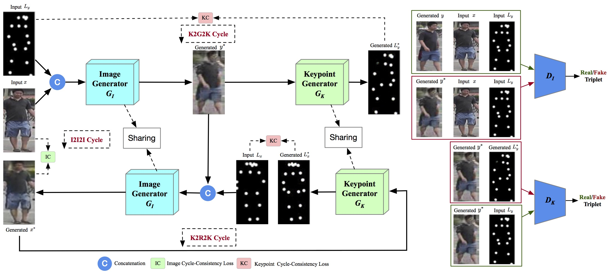

[](https://github.com/Ha0Tang/C2GAN/blob/master/LICENSE.md)


[]((https://github.com/Ha0Tang/C2GAN/graphs/commit-activity))


## Contents
  - [Cycle-In-Cycle GANs](#Cycle-In-Cycle-GANs)
  - [Installation](#Installation)
  - [Dataset Preparation](#Dataset-Preparation)
  - [Generating Images Using Pretrained Model](#Generating-Images-Using-Pretrained-Model)
  - [Train and Test New Models](#Train-and-Test-New-Models)
  - [Acknowledgments](#Acknowledgments)
  - [Related Projects](#Related-Projects)
  - [Citation](#Citation)
  - [Contributions](#Contributions)

## Cycle-In-Cycle GANs
**| [Conference Paper](https://arxiv.org/abs/1908.00999) | [Extended Paper](https://arxiv.org/abs/2106.10876) | [Project](http://disi.unitn.it/~hao.tang/project/C2GAN.html) |** <br>
**[Cycle In Cycle Generative Adversarial Networks for Keypoint-Guided Image Generation](https://arxiv.org/abs/1908.00999)** <br>
[Hao Tang](http://disi.unitn.it/~hao.tang/)<sup>1</sup>, [Dan Xu](http://www.robots.ox.ac.uk/~danxu/)<sup>2</sup>, [Gaowen Liu](https://dblp.uni-trier.de/pers/hd/l/Liu:Gaowen)<sup>3</sup>, [Wei Wang](https://weiwangtrento.github.io/)<sup>4</sup>, [Nicu Sebe](https://scholar.google.com/citations?user=stFCYOAAAAAJ&hl=en)<sup>1</sup> and [Yan Yan](https://scholar.google.com/citations?user=zhi-j1wAAAAJ&hl=en)<sup>3</sup> </br>
<sup>1</sup>University of Trento, <sup>2</sup>University of Oxford, <sup>3</sup>Texas State University, <sup>4</sup>EPFL </br>
The repository offers the official implementation of our paper in PyTorch.

### C2GAN Framework


### [License](./LICENSE.md)
<a rel="license" href="http://creativecommons.org/licenses/by-nc-sa/4.0/"></a><br />
Copyright (C) 2019 University of Trento, Italy.

All rights reserved.
Licensed under the [CC BY-NC-SA 4.0](https://creativecommons.org/licenses/by-nc-sa/4.0/legalcode) (**Attribution-NonCommercial-ShareAlike 4.0 International**)

The code is released for academic research use only. For commercial use, please contact [bjdxtanghao@gmail.com](bjdxtanghao@gmail.com).

## Installation

Clone this repo.
```bash
git clone https://github.com/Ha0Tang/C2GAN
cd C2GAN/
```

This code requires PyTorch 0.4.1+ and python 3.6.9+. Please install dependencies by
```bash
pip install -r requirements.txt (for pip users)
```
or 

```bash
./scripts/conda_deps.sh (for Conda users)
```

To reproduce the results reported in the paper, you would need an NVIDIA TITAN Xp GPUs.

## Dataset Preparation
For your convenience we provide download scripts:
```
bash ./datasets/download_c2gan_dataset.sh RaFD_image_landmark
```
- `RaFD_image_landmark`: 3.0 GB

or you can use `./scripts/convert_pts_to_figure.m` to convert the generated pts files to figures.

Prepare the datasets like in [this folder](./datasets/Radboud) after the download has finished. Please cite their paper if you use the data.

## Generating Images Using Pretrained Model
- You need download a pretrained model (e.g., Radboud) with the following script:
```
bash ./scripts/download_c2gan_model.sh Radboud
```
- The pretrained model is saved at `./checkpoints/{name}_pretrained/latest_net_G.pth`. 
- Then generate the result using
```
python test.py --dataroot ./datasets/Radboud --name Radboud_pretrained --model c2gan --which_model_netG unet_256 --which_direction AtoB --dataset_mode aligned --norm batch --gpu_ids 0 --batch 16;
```
The results will be saved at `./results/`. Use `--results_dir {directory_path_to_save_result}` to specify the results directory.

- For your own experiments, you might want to specify --netG, --norm, --no_dropout to match the generator architecture of the trained model.

## Train and Test New Models
- Download a dataset using the previous script (e.g., Radboud).
- To view training results and loss plots, run `python -m visdom.server` and click the URL [http://localhost:8097](http://localhost:8097).
- Train a model:
```
sh ./train_c2gan.sh
```
- To see more intermediate results, check out `./checkpoints/Radboud_c2gan/web/index.html`.
- Test the model:
```
sh ./test_c2gan.sh
```
- The test results will be saved to a html file here: `./results/Radboud_c2gan/latest_test/index.html`.

## Acknowledgments
This source code is inspired by [Pix2pix](https://github.com/junyanz/pytorch-CycleGAN-and-pix2pix), and [GestureGAN](https://github.com/Ha0Tang/GestureGAN).

## Related Projects
**[BiGraphGAN](https://github.com/Ha0Tang/BiGraphGAN) | [XingGAN](https://github.com/Ha0Tang/XingGAN) | [GestureGAN](https://github.com/Ha0Tang/GestureGAN) | [SelectionGAN](https://github.com/Ha0Tang/SelectionGAN) | [Guided-I2I-Translation-Papers](https://github.com/Ha0Tang/Guided-I2I-Translation-Papers)**

## Citation
If you use this code for your research, please cite our paper.

C2GAN
```
@article{tang2021total,
  title={Total Generate: Cycle in Cycle Generative Adversarial Networks for Generating Human Faces, Hands, Bodies, and Natural Scenes},
  author={Tang, Hao and Sebe, Nicu},
  journal={IEEE Transactions on Multimedia (TMM)},
  year={2021}
}

@inproceedings{tang2019cycleincycle,
  title={Cycle In Cycle Generative Adversarial Networks for Keypoint-Guided Image Generation},
  author={Tang, Hao and Xu, Dan and Liu, Gaowen and Wang, Wei and Sebe, Nicu and Yan, Yan},
  booktitle={ACM MM},
  year={2019}
}
```

If you use the original [BiGraphGAN](https://github.com/Ha0Tang/BiGraphGAN), [XingGAN](https://github.com/Ha0Tang/XingGAN), [GestureGAN](https://github.com/Ha0Tang/GestureGAN), and [SelectionGAN](https://github.com/Ha0Tang/SelectionGAN) model, please cite the following papers:

BiGraphGAN
```
@inproceedings{tang2020bipartite,
  title={Bipartite Graph Reasoning GANs for Person Image Generation},
  author={Tang, Hao and Bai, Song and Torr, Philip HS and Sebe, Nicu},
  booktitle={BMVC},
  year={2020}
}
```

XingGAN
```
@inproceedings{tang2020xinggan,
  title={XingGAN for Person Image Generation},
  author={Tang, Hao and Bai, Song and Zhang, Li and Torr, Philip HS and Sebe, Nicu},
  booktitle={ECCV},
  year={2020}
}
```

GestureGAN
```
@article{tang2019unified,
  title={Unified Generative Adversarial Networks for Controllable Image-to-Image Translation},
  author={Tang, Hao and Liu, Hong and Sebe, Nicu},
  journal={IEEE Transactions on Image Processing (TIP)},
  year={2020}
}

@inproceedings{tang2018gesturegan,
  title={GestureGAN for Hand Gesture-to-Gesture Translation in the Wild},
  author={Tang, Hao and Wang, Wei and Xu, Dan and Yan, Yan and Sebe, Nicu},
  booktitle={ACM MM},
  year={2018}
}
```

SelectionGAN
```
@inproceedings{tang2019multi,
  title={Multi-channel attention selection gan with cascaded semantic guidance for cross-view image translation},
  author={Tang, Hao and Xu, Dan and Sebe, Nicu and Wang, Yanzhi and Corso, Jason J and Yan, Yan},
  booktitle={CVPR},
  year={2019}
}

@article{tang2020multi,
  title={Multi-channel attention selection gans for guided image-to-image translation},
  author={Tang, Hao and Xu, Dan and Yan, Yan and Corso, Jason J and Torr, Philip HS and Sebe, Nicu},
  journal={arXiv preprint arXiv:2002.01048},
  year={2020}
}
```

## Contributions
If you have any questions/comments/bug reports, feel free to open a github issue or pull a request or e-mail to the author Hao Tang ([bjdxtanghao@gmail.com](bjdxtanghao@gmail.com)).

## Collaborations
I'm always interested in meeting new people and hearing about potential collaborations. If you'd like to work together or get in contact with me, please email bjdxtanghao@gmail.com.
___
*If you can do what you do best and be happy, you're further along in life than most people.*
